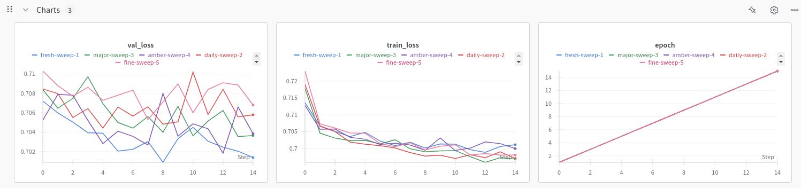
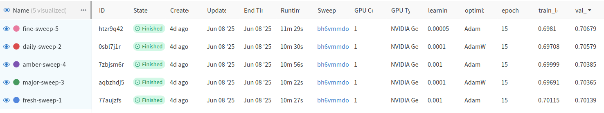

# Unet-For-Polyp-Segmentation-In-Colonoscopy
Includes a Unet implmentation for polyp segmentation in colonoscopy.

<br>

## Table of Contents

- [Installation](#installation)
- [Usage](#usage)
- [Dataset Information](#dataset-information)
- [Training/Inference code and Performance visualisation](#traininginference-code-and-performance-visualisation)
- [About the Model](#about-the-model)
- [Performance Metrices](#performance-metrics)

<br>

## Installation

To run this project, you need to have Python installed. We recommend using a virtual environment to manage dependencies.

1. **Clone the repository**:
    ```sh
    git clone <repository-url>
    cd <repository-folder>
    ```

2. **Create a virtual environment**:
    ```sh
    python -m venv env
    source env/bin/activate  # On Windows, use `env\Scripts\activate`
    ```

3. **Install dependencies**:
    ```sh
    pip install -r requirements.txt
    ```

<br>

## Usage

1.  **Run main.py in the following manner to train and test the model normally**:
    ```sh
    python3 main.py normal
    ```
2. **Run main.py in the following manner to train the model by tuning hyperparameters using wanb sweep**:
    ```sh
    python3 main.py wandb
    ```
3. The following are the files and their purpose :
   
    - **dataset.py** : Defines a CustomDataset class for loading and preprocessing image-mask pairs for segmentation tasks using PyTorch.
      
    - **main.py** : Main script to run either a standard training/testing pipeline or initiate a Weights & Biases sweep for model training.
      
    - **metrics.py** : Provides functions to compute IoU and Dice scores for evaluating segmentation model performance.
      
    - **test.py** : Defines the testing function for a segmentation model, computing average IoU and Dice scores using a validation transform.
      
    - **train_val.py** : Implements training and validation loops for UNet-based segmentation models using Dice loss, LR scheduler, and Weights & Biases integration.
      
    - **transform.py** : Defines training and validation data augmentation pipelines using Albumentations for image preprocessing and tensor conversion.
      
    - **unet.py** : Implements a full U-Net architecture from scratch in PyTorch for semantic segmentation.
      
    - **unet_b4.py** : Defines a U-Net segmentation model using a pretrained EfficientNet-B4 encoder from the timm library for feature extraction.
      
    - **unet_smp.py** : Initializes a segmentation model using the segmentation_models_pytorch (SMP) library with an EfficientNet-B4 encoder.
      
    - **utils.py** : Plots a few examples of model predictions alongside the original image and ground truth mask.
      
    - **wandb_setup.py** : Performs U-Net training with EfficientNet-B4 encoder and wandb sweep tracking.
      
    - **wandb_sweep.py** : Defines a W&B sweep with Bayesian optimization to tune learning rate and optimizer.


<br>

## Dataset Information
The model used in this project is trained on 'Kvasir-SEG Dataset'. The dataset contains 1000 polyp images and their corresponding ground truth from the Kvasir Dataset v2. The images and its corresponding masks are stored in two separate folders with the same filename. 

- **Source** : [Kvasir SEG Dataset](https://datasets.simula.no/kvasir-seg/)
- **Task** : Polyp Identification in colonoscopy imaged (Identify and mask the polyp from the image).
- **Data** : 1000 captcha polyp images with resolution varying from 332x487 to 1920x1072.
- **Masks** : The images and its corresponding masks are stored in two separate folders with the same filename.
- **Example** : The following are examples for the data image and mask. Not that the files are named the same though in seperate folders.
- 
- 

<br>

## Sweeping, Training and Testing


- Three types of Unet models where used in different instances for the project [They are mentioned below].
- WandB sweeps were then done on the models to find out the best hyperparameters.
- The model was then trained with these hyperparameters and depending upon their performance additional adjustments were made.
- The model was then finally tested.
- The following models for used for segmentation :
    - Unet model from scratch
    - Unet model from scratch with efficientb4 as encoder [Second best approach]
    - Unet model from smp library [Best approach]       
- WandB sweep result :
    - The validation range is jittery due to the small batch_size, small validation data size and small difference betwen the losses.    
    - 
    - 
- The following is the plot of train and validation Dice loss across epochs in Best approach :
    - 
- The following is the plot of train and validation Dice loss across epochs in Second best approach :
    - 
- Example prediction :
    -  

<br>

## About the Model
The project uses the Unet model from `segmentation_models_pytorch` for achieving polyp segmentation in colonoscopy images. The best hyperparamets for the model was chosen after running sweeps using wandb and running deliberations on the result. 
The final hyperparameters and other parameters used are :
- encoder_name : efficient-b4
- encoder_weights : imagenet
- in_channels : 3
- classes : 1
- batch_size : 2
- optimizer : Adam
- learning_rate : 0.0001
- epochs : 15
  
    - On final testing, the Unet model from smp library with the above paramters gave a performance score of 0.7910 (IoU) and 0.8644 (Dice) [Best approach].
      
    - On final testing, the Unet model from scratch with efficientb4 model gave a performance score of 0.772 (IoU) and 0.8520 (Dice). [Seocnd best approach]
      
    - On final testing, the Unet model from scratch gave a very poor performance that renders it futile to even consider it.
 

<br>

## Performance Metrics
- Training : DiceLoss as loss function.
- Testing  : IoU score and Dice Score as evaluation metrics.
